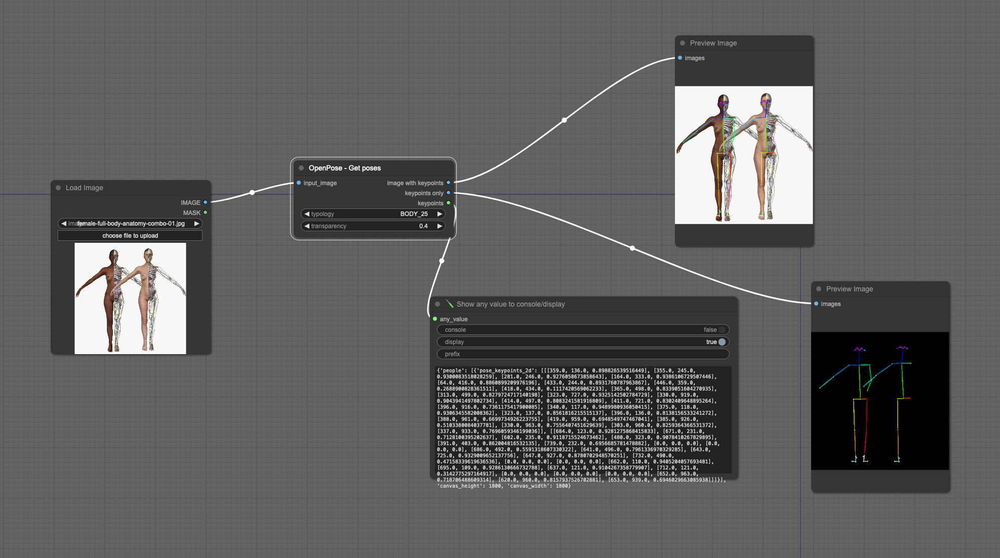
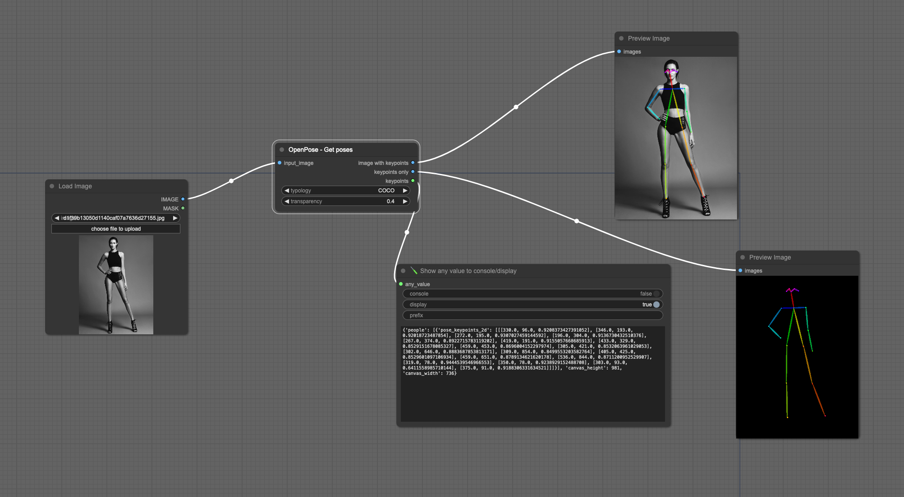

# OpenPose Node

This repository contains a Python implementation for extracting and visualizing human pose keypoints using OpenPose models. 
The `OpenPoseNode` class allows users to input images and obtain the keypoints and limbs drawn on the images with adjustable transparency. 
Additionally, it can provide an image with only the keypoints drawn on a black background, and the keypoints value in a JSON format.

## Example

You can find the example workflow [here](example/openpose.json)

## Features
- Download OpenPose models from Hugging Face Hub and saves them on `ComfyUI/models/openpose`
- Process imput image (only one allowed, no batch processing) to extract human pose keypoints.
- Draw keypoints and limbs on the original image with adjustable transparency.
- Generate an image with only the keypoints drawn on a black background.
- Generate JSON with list of keypoints
- Choose between two OpenPose representations: COCO and BODY_25.

### Prerequisites
Ensure you have the following packages installed:
- `torch`
- `cv2` (OpenCV)
- `numpy`
- `huggingface_hub`
- `torchvision`

you can install them with 
- `pip install -r requirement.txt`

or
- `python install.py`

## Acknowledgements

Special thanks to [beingjoey/pytorch_openpose_body_25](https://github.com/beingjoey/pytorch_openpose_body_25) for the inspiration. Their work provided a foundation and motivation for developing this custom node.

## Contributing

We welcome contributions! If you find any issues or have suggestions for improvements, please open an issue or submit a pull request.

## License

This project is licensed under the GPL-3.0 License. See the [LICENSE](LICENSE) file for details.

---
---

Thank you for using the OpenPose node for ComfyUI. We hope it enhances your image processing workflows!
